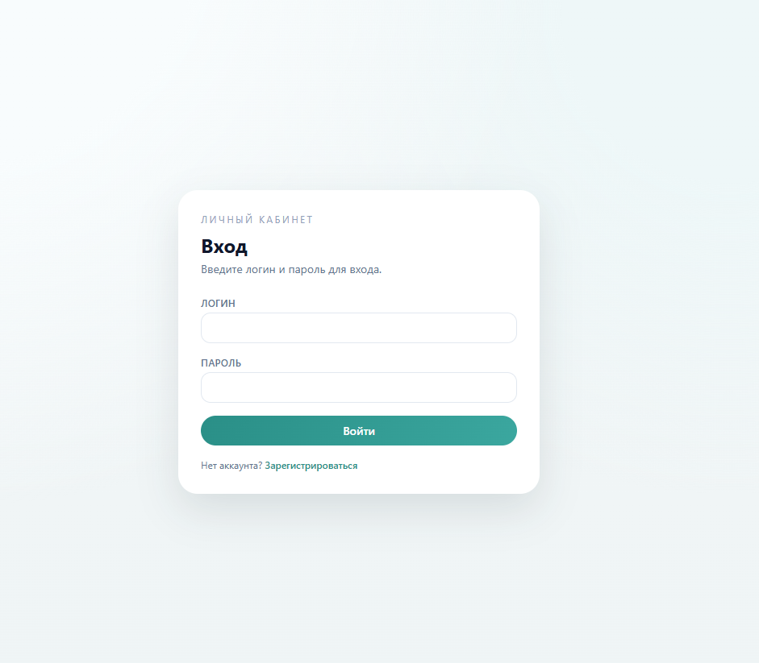
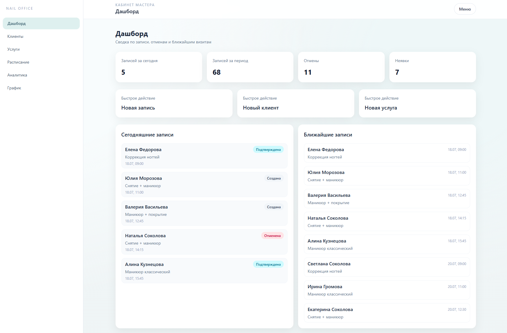
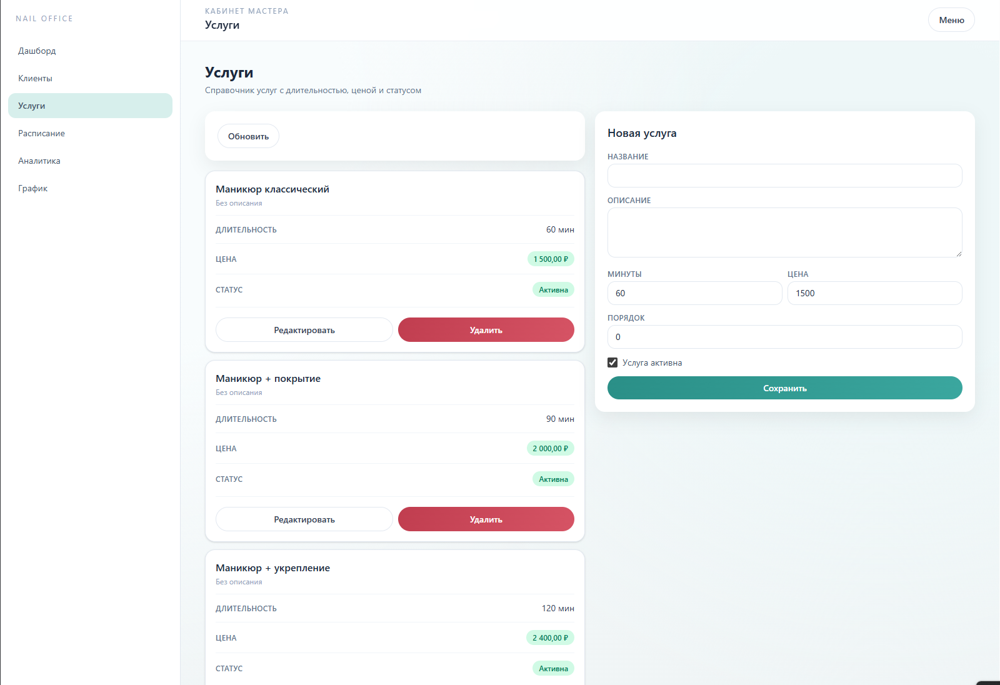
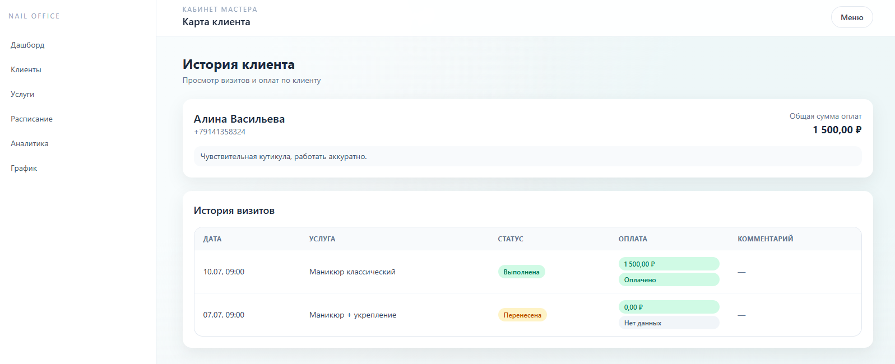
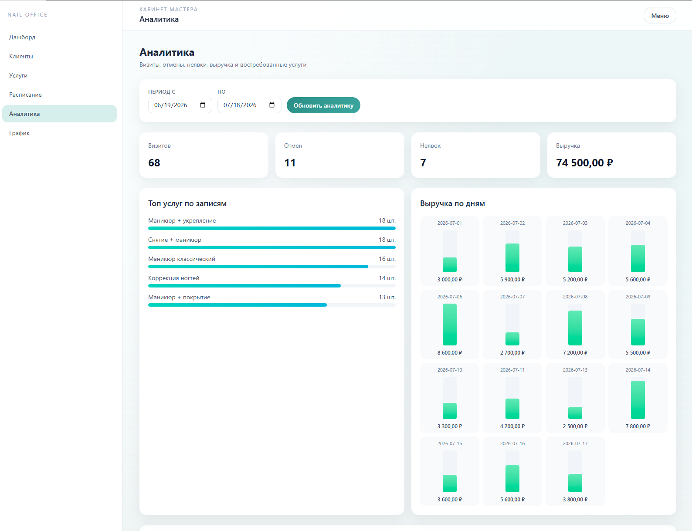
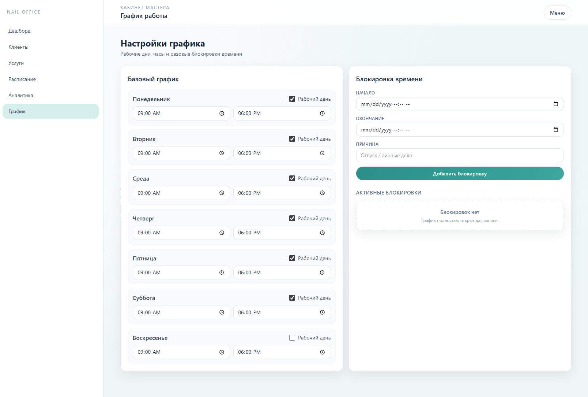

# Nail Office — Frontend

Vue 3-интерфейс кабинета мастера маникюра: клиенты, услуги, расписание, аналитика и публичная запись.

## Стек

- Vue 3 + TypeScript
- Vite 8
- Pinia
- Vue Router
- Tailwind CSS 4
- Axios
- Vitest + Vue Test Utils

## Быстрый старт

Нужен запущенный backend на `http://localhost:8000` (см. корневой README).

```bash
cd frontend
npm install
copy .env.example .env
npm run dev
```

Откроется `http://localhost:5173`.

Демо-мастер: `master` / `master12345`

## Скрипты

| Команда | Что делает |
| --- | --- |
| `npm run dev` | Dev-сервер Vite (порт 5173) |
| `npm run build` | `vue-tsc` + production-сборка в `dist/` |
| `npm run preview` | Превью собранного `dist/` |
| `npm run test` | Vitest один прогон |
| `npm run test:watch` | Vitest в watch-режиме |

## Переменные окружения

Файл `.env` (шаблон — `.env.example`):

```env
VITE_API_BASE_URL=http://localhost:8000/api/v1
```

## Структура

```text
src/
  app/           # App.vue, роутер, провайдеры
  entities/      # session, client, service, appointment, payment, visit, analytics, ...
  pages/         # экраны мастера, клиента и публичной записи
  widgets/       # AppShell (сайдбар + шапка)
  shared/        # UI, HTTP-клиент, utils, типы, toast
  test/          # setup для Vitest
screens/         # скриншоты интерфейса для документации
```

Алиас импортов: `@/` → `src/`.

## Маршруты

### Публичные
- `/login`, `/register`
- `/book`, `/book/success`

### Кабинет мастера
- `/dashboard` — сводка за день и период, быстрые действия
- `/clients`, `/clients/:id` — список и карта клиента с историей
- `/services` — справочник услуг
- `/schedule` — записи
- `/appointments/:id` — карточка записи (визит, оплата, фото)
- `/analytics` — визиты, отмены, выручка, топ услуг
- `/settings/schedule` — рабочий график и блокировки

### Кабинет клиента
- `/client/book`
- `/client/appointments`
- `/client/notifications`

## Скриншоты

### Вход



### Дашборд



### Услуги



### Карта клиента



### Аналитика



### График работы



## Архитектура (коротко)

- **entities** — API-классы, типы DTO, Pinia-stores где нужно
- **pages** — экраны, без прямого бизнес-API в обход entities
- **widgets/app-shell** — навигация мастера/клиента, logout
- **shared/api** — `HttpClient` с Token auth и обработкой 401
- Роутер: `meta.public` / `meta.requiresAuth` / `meta.roles`

## Тесты

```bash
npm run test
```

Сейчас есть smoke/component-тесты:
- `LoginPage`
- `PublicBookingPage`

## Docker

Из корня репозитория:

```bash
docker compose up --build
```

Frontend в compose слушает `5173`, API — через `VITE_API_BASE_URL`.
